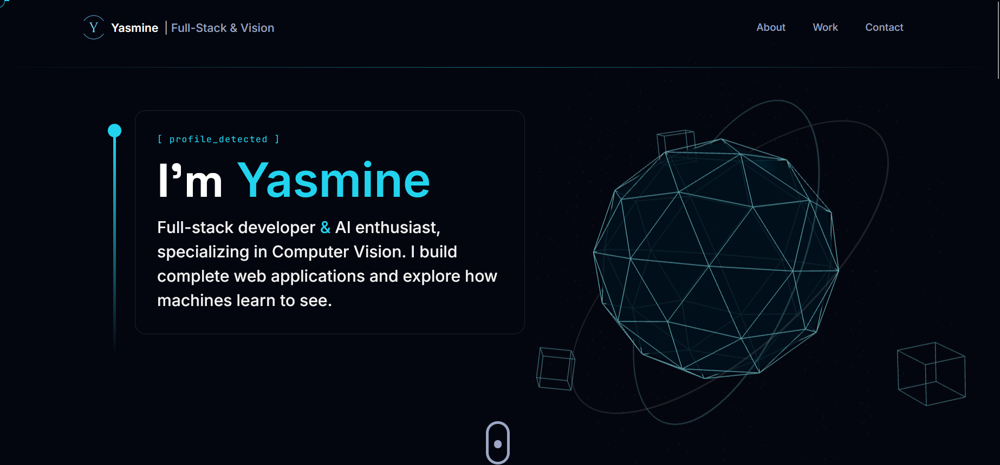

# Yasmine Bounasla — Portfolio

Personal 3D portfolio built with React and Three.js.

**Live site:** [portfolio-liart-eight-63.vercel.app](https://portfolio-liart-eight-63.vercel.app)


<!-- Remplace par une vraie capture (Hero de préférence), nommée "screenshot.png", à la racine du projet. -->

## Stack

**Frontend** — React, Tailwind CSS, Framer Motion
**3D** — Three.js, React Three Fiber, @react-three/drei
**Backend / tooling** — Node.js, Express, Prisma, MongoDB
**AI / ML** — Python, TensorFlow, PyTorch, OpenCV, Scikit-learn
**Contact form** — EmailJS

## Run locally

```bash
git clone https://github.com/yasminebounasla/3D-portfolio.git
cd 3D-portfolio
npm install
```

Create a `.env` file at the root (see `.env.example`):
```
VITE_APP_EMAILJS_SERVICE_ID=your_service_id
VITE_APP_EMAILJS_TEMPLATE_ID=your_template_id
VITE_APP_EMAILJS_PUBLIC_KEY=your_public_key
```

```bash
npm run dev
```

## License

Personal project. Feel free to draw inspiration from the code, but please don't reuse the content or assets as your own.